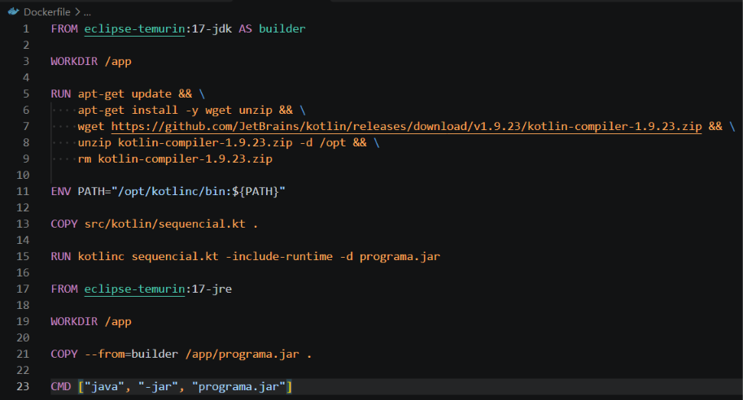
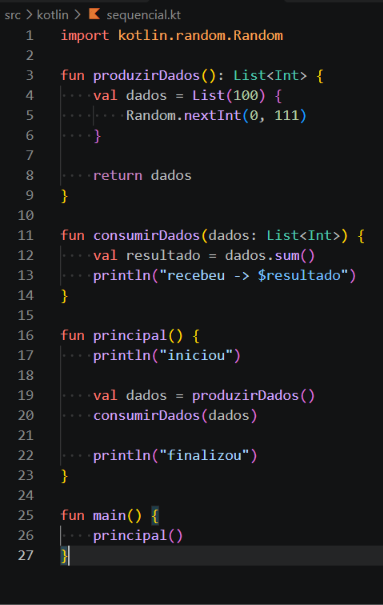
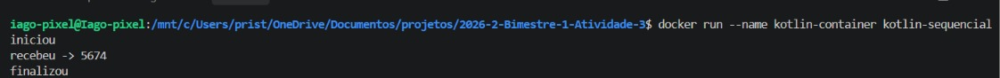

# Relatório sobre implementação de comunicação entre tarefas em Kotlin

## Introdução

Este relato faz parte do processo avaliativo da disciplina de sistemas operacionas no curso superior em análise e desenvolvimento de sistemas, ofertado na Diretoria acadêmica de gestão e tecnologia da informação no campus natal-central do instituto federal de educação, ciência e tecnologia do rio grande do norte.

Tem como objetivo principal relatar as implementações de comunicação entre tarefas na linguagem Kotlin.

O grupo de trabalho foi formado por Ana Letícia Vidal de Oliveira, Iago Vinícius Souza de Sales e Valentine Varela.

## Comunicação entre tarefas em Kotlin

### Informações gerais

#### Objetivo da comunicação entre tarefas

> O objetivo da comunicação entre tarefas é permitir que diferentes tarefas ou coroutines troquem informações e coordenem suas atividades durante a execução de um programa.

#### Por que Docker?

> O Docker é utilizado para criar um ambiente padronizado para executar o projeto. Nesse trabalho, ele permite configurar previamente o Kotlin e suas dependências, garantindo que o código seja executado da mesma forma, independentemente do computador utilizado.

> Além disso, o Docker facilita a instalação, configuração e execução do projeto, evitando problemas relacionados a diferentes versões do Kotlin, Java ou bibliotecas.

#### Configuração do Dockerfile

- Usa imagem eclipse-temurin:17-jdk
- Pasta base: /app
- Atualiza pacotes e configura o compilador Kotlin
- Pega o arquivo e compila em programa.jar
- Começa uma nova imagem, sem o compilador Kotlin
- Redefine /app e pega o programa.jar
- Executa o programa.jar

                 PRIMEIRA ETAPA
              ┌──────────────────┐
              │ JDK 17           │
              │                  │
              │ Kotlin Compiler  │
              │       ↓          │
              │ [nome].kt        │
              │       ↓          │
              │ programa.jar     │
              └────────┬─────────┘
                       │
                       │ copia apenas o .jar
                       ▼
                 SEGUNDA ETAPA
              ┌──────────────────┐
              │ JRE 17           │
              │                  │
              │ programa.jar     │
              │       ↓          │
              │ java -jar        │
              └──────────────────┘



### Comunicação entre tarefas com linhas de execução no mesmo processo

#### O código

> A primeira linha desse código permite que o program faço o importe de uma classe do pacote nativo que gera números aleatórios.

> Após isso é criada a função "produziDados" que indica o retorno de uma lista de números inteiros.


> Temos, então, o bloco dentro das chaves é executado 100 vezes (uma para cada elemento da lista). A cada repetição, Random.nextInt(0, 111) gera um inteiro aleatório no intervalo de 0 a 110 (o limite 111 é exclusivo).

> Após isso, temos a função "consumirDados" que realiza uma operação de soma de todos os valores recebidos na lista e gera o resultado que é colocado no terminal.


> Logo após temos a principal função definida como "principal", essa função realiza a chamada da produção de dados e atirbui a lista a variavel "dados" após isso faz a chamada para afunção seguinte que realiza a operação já mencionada. Ela coloca no terminal o inicio e o fim do processo.



#### Execução

> Para executar o código foi preciso configurar o Dockerfile, buildar a imagem e então executar um container. As configurações do Dockerfile deixam todo o processo automatizado.



#### Problemas enfrentados

> Unico problema enfretado foi que o Docker não encontrou a imagem zenika/kotlin:1.9-jdk17, que é uma imagem que já vem com o kotlin. Foi então necessário usar uma imagem oficial do Java e configurar nela o compilador do kotlin.

### Comunicação entre tarefas em processos diferentes no mesmo computador

#### O código

> O arquivo `consumidor.kt` utiliza Coroutines (`kotlinx.coroutines`), que são alternativas mais leves às threads, para realizar a comunicação concorrente.

> Uma lista global mutável chamada `dados` é compartilhada. A função `produzirDados` preenche essa lista, e `consumirDados` realiza a soma.

> Na função principal, usamos `runBlocking` e `launch` para disparar as tarefas. O comando `jobProdutor.join()` obriga o consumidor a esperar a produção terminar, evitando erros de leitura antes do tempo.

```kotlin
import kotlinx.coroutines.*
import kotlin.random.Random

var dados = mutableListOf<Int>()

fun produzirDados() {
    println("# produzir - iniciado")
    dados = List(100) { Random.nextInt(0, 111) }.toMutableList()
    println("# produzir $dados")
    println("# produzir - terminado")
}

fun consumirDados() {
    println("### consumir - iniciado")
    println("### dados -> $dados")
    val resultado = dados.sum()
    println("### resultado -> $resultado")
    println("### consumir - terminado")
}

fun main() = runBlocking {
    println("iniciou")

    val jobProdutor = launch {
        produzirDados()
    }

    jobProdutor.join()

    val jobConsumidor = launch {
        consumirDados()
    }
    jobConsumidor.join()

    println("finalizou")
}

#### Execução

> Para a execução, o Servidor é iniciado primeiro. Assim que o Cliente se conecta via IP e porta, a transferência de dados ocorre com sucesso.

#### Problemas enfrentados
> O principal entrave foi o isolamento de rede do Docker, que bloqueia conexões externas por padrão. A solução é usar a flag -p 12345:12345 ao rodar o container para mapear a porta e liberar o acesso.

## Considerações finais
> O grupo conseguiu implementar e executar com sucesso todas as atividades, adaptando a lógica de concorrência para as ferramentas nativas do Kotlin.

> O maior aprendizado foi entender o uso de Coroutines e consolidar os conhecimentos em Docker, destacando a técnica de multi-stage build que separou a compilação da execução do projeto.

> Para próximos alunos, recomendamos configurar o Docker logo no início para evitar problemas de versão entre as máquinas, e ler atentamente a documentação de Coroutines, já que a lógica de sincronização difere de Threads tradicionais.


